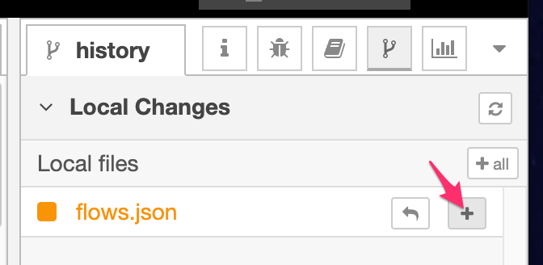
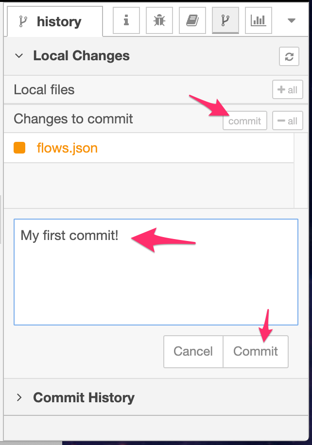
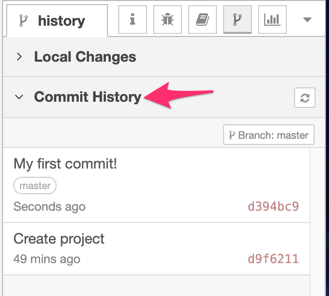

# Committing Changes

Before we move on with the workshop, the next thing to learn about is how to commit
changes you've made in your project.

!!! note
    If you skipped over the previous step to create a flow, you won't have
    any changes to commit. Add a node to your workspace and click the Deploy button
    so you have a change to commit.

1. Open the History sidebar tab. This is where you can see the changes to your
   project that are ready to be staged and committed to the git repository.
2. You should see your flow file listed in the Local Files section. Clicking on
   it will open a dialog showing the changes to the file since it was last
   committed.

     {: style="width: 200px"}

3. Click the `+` that appears when you hovered over the file name. The entry
   will move to the 'Changes to commit' section.
4. Do the same for any other files in the Local Files section.
5. Click the `commit` button at the top of the 'Changes to commit' section.
6. Enter a commit message and click the Commit button.

     {: style="width: 200px"}

7. Expand the 'Commit History' section of the sidebar. This lists the history
   of commits for the project. At this point there should be two commits - the
   original commit from when the project was created, and the one you've just
   created.

     {: style="width: 200px"}

## Next Steps

Your Node-RED environment is all setup now for the rest of this workshop.

In the next part, we'll start looking at [Node-RED Dashboard](./part2/).
