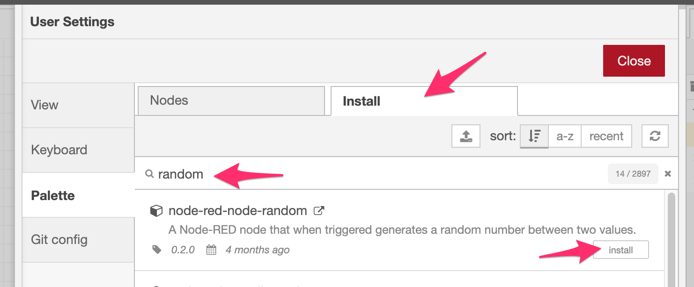

# Installing Nodes

The building blocks of any Node-RED application are the nodes in its palette.

Node-RED comes with a number of core nodes that provide the basic components,
but the palette can be easily extended by installing additional nodes.

Nodes are published as npm modules and the project provides an online catalogue
of them at [https://flows.nodered.org](https://flows.nodered.org).


There are two ways to install nodes - via the command-line or from within the
Node-RED editor.

### Node-RED Palette Manager

To install a node from within the editor, select the Manage Palette option from
the main menu.

This opens the Palette Manager which shows two tabs - a list of the modules you
have installed and a searchable catalogue of modules available to install.

Switch to the Install tab and search for `random` - you should see `node-red-node-random` in the list below. Click the `install` button next to it.

{: style="width:350px"}

After a short time the node will be installed and added to the palette.

### Command-line

To install on the command-line, switch to the Node-RED user directory, `~/.node-red` by default, and run the appropriate `npm install` command. For example:

```
npm install node-red-node-random
```

!!! note
    Some nodes will have external dependencies that cannot be automatically
    installed by Node-RED or npm. You should always check a module's readme
    for further information. This will be particularly true of some of the
    TensorFlow nodes we'll be using later in this workshop.

## Next Steps

The next task is to [create you first flow in Node-RED](create-flow.md).

