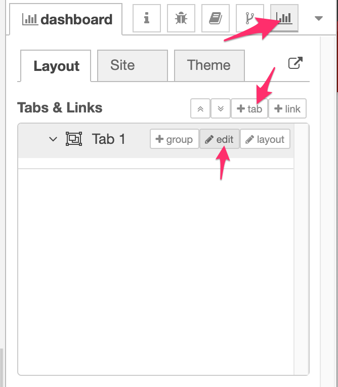
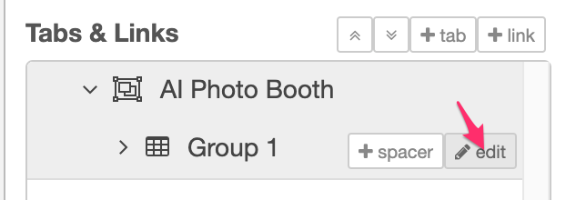
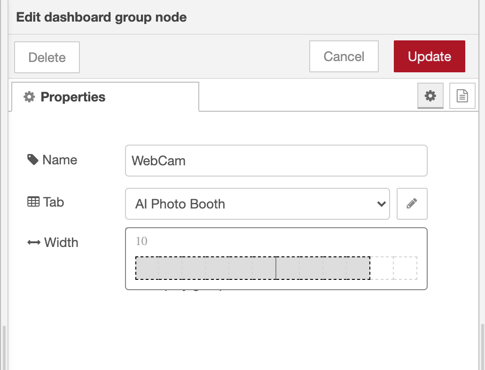
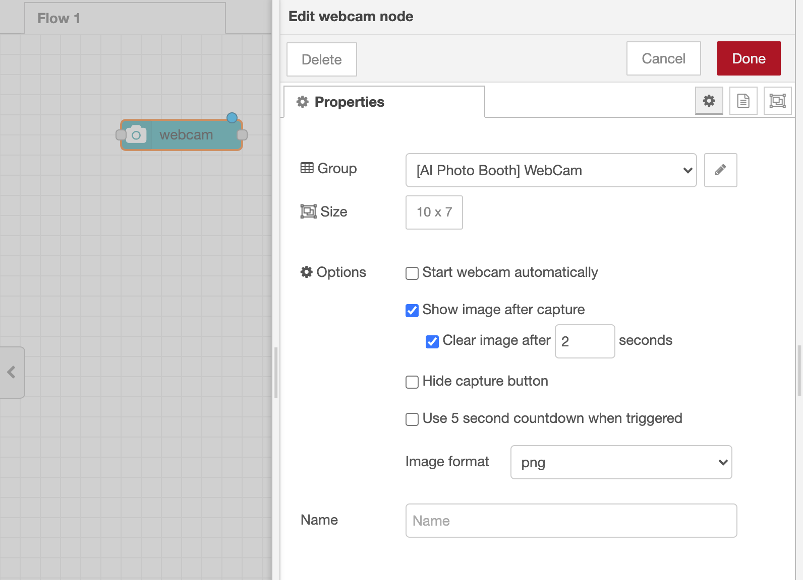
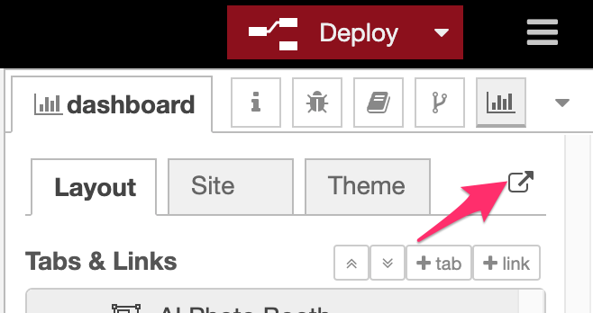
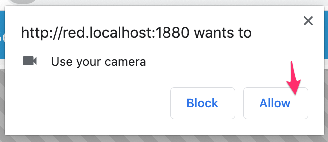
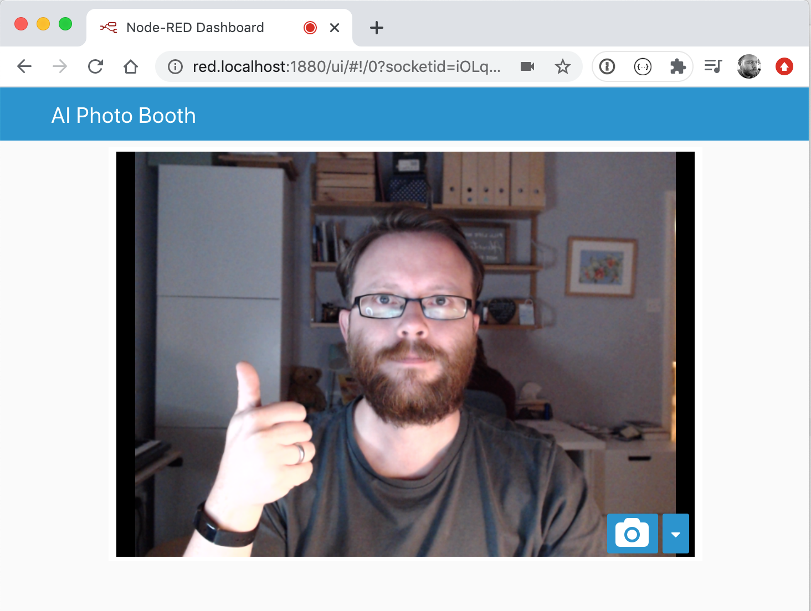
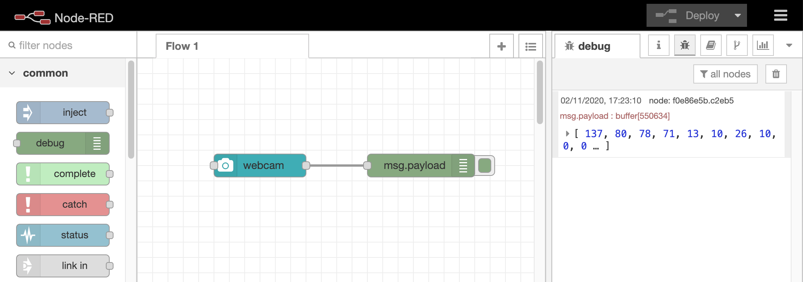
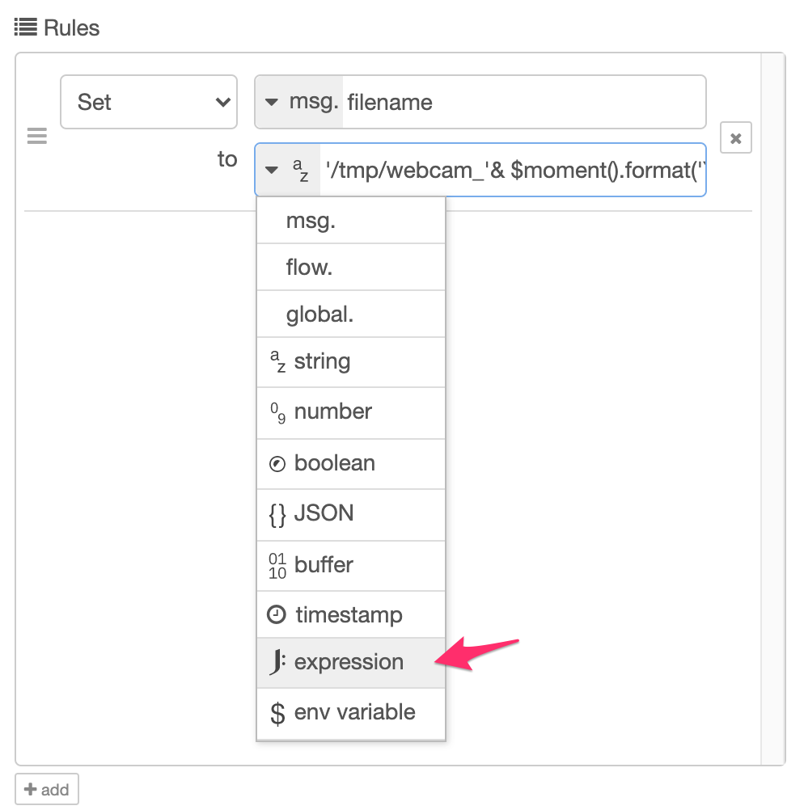

# Create a dashboard

In this part of the workshop you will begin to create your Photo Booth application.

## Dashboard Layouts

The Dashboard uses a grid based layout. Widgets, such as buttons or text boxes, are
given a size in grid-cells. They are packed into a group that has a defined width.
The Groups are then placed on a Tab - laid out using a flow-based layout, filling
the width of the page before wrapping. This arrangement provides some flexibility
in how the page displays on different screen sizes.

## Dashboard Sidebar

Within the editor, the Dashboard module provides a sidebar where you can customise
its features as well as manage its tabs, groups and widgets.

1. Open the Dashboard sidebar
2. Click the `+ tab` button to create a new tab.
3. Hover over the newly added tab and click the `edit` button.

       {: style="width: 250px"}

4. In the edit dialog, give the tab a name of `AI Photo Booth` and click Update
   to close the dialog.
5. Hover over the tab again and click the `+ group` button.
6. Edit the new group and set its properties:

       {: style="width: 250px"}

    - Set the name to `WebCam`
    - Set the width to `10` by clicking the button and dragging the box out to 10
      units wide.
    - Untick the 'Display group name' option.

       {: style="width: 300px"}

This has created the initial layout components needed for the dashboard. You can
now start to add content.

## Adding a `ui_webcam` node

!!! note "Tidy up existing flows"
    If you followed the previous part of the workshop, you'll have some example
    flows in your workspace. You can delete those flows as you won't need them
    for the rest of the workshop.

1. Drag a `ui_webcam` node from the `dashboard` category of the palette into your
   workspace. This node can be used to capture images from the webcam on the
   device displaying the dashboard.

       {: style="width: 500px"}

2. Double click on the node to edit its properties.
3. Make sure the `WebCam` group you created earlier is selected in the select box.
5. Set the size to `10x7` - note that it will not let you make it wider than the
   group it is in.
5. Leave the rest of the options as their defaults for now and click Done.

     At this point you have created a dashboard with a single tab, containing a
   single group that contains a webcam widget.

6. Click the Deploy button to save your changes.

To access the Dashboard, click the button in the top-right corner of the Dashboard
sidebar. This will open the Dashboard in a new browser tab.

{: style="width: 250px"}

Click on the camera button in the middle of the screen to turn on the web cam.
Your browser will ask your permission for the page to access the web cam - make
sure to allow access or you won't get much further.

{: style="width: 250px"}

You should then get a live feed of your web cam on the page.

!!! attention "Troubleshooting"
    Due to standard browser security practices, you will only be able to use
    the web cam if you are accessing the page using `localhost` or `127.0.0.1`
    on the local device, or that you are using `https` if accessing it on another device.

    It's beyond the scope of this workshop to get `https` setup - so we
    assume you are running Node-RED on the same device you are using to access
    the dashboard.

You can click the camera button to take a photo - the image should pause for a
couple seconds before resuming the live feed.

But at this point, nothing has happened with the photo you just took. The next
task is to build a flow to do something with it.

## Capturing photos

1. Back in the Node-RED editor, edit the `ui_webcam` node as follows:
    - Enable the 'start webcam automatically' option - this removes the need
     to click the camera button each time the dashboard is refreshed.
    - Change the Image format to `jpeg` - this is the format needed by the
      TensorFlow nodes later on in this workshop. Make the change now so
      we don't forget - but we'll remind you later on.
    - Click Done to close the dialog.
2. Add a new Debug node into the workspace. Drag a wire from the output of the
   Webcam node to the input of the Debug node.
3. Click Deploy to save your changes.

When you switch back to the Dashboard page the camera should already be running.
Click the button to take a photo then switch back to the Node-RED editor.

Open the Debug sidebar. You should see a message has been logged showing the
received payload was a Buffer. This is the raw image data in `jpeg` format.

The next task is to start writing the photo to a file.

## Saving photos to a file

1. From the output of the webcam node, wire in a Change node followed by a File
   node.
2. Configure the Change node as follows:
     - Change the default rule to set `msg.filename` instead of `msg.payload`.
     - Change the type of the `to` field to `expression` (click the drop-down
       arrow on the left-hand edge of the field to select the type)
     - Set the value of the `to` field to:

            '/tmp/webcam_'& $moment().format('YYYY-MM-DD-hhmmss') & '.jpeg'

         This will generate a new filename containing the current date and time
         each time a message passes through the node.

         If you are running on Windows, be sure to modify the `/tmp/` part of the
       path to something suitable.

         {: style="width: 400px" }

3. Configure the File node as follows:
     - Set the Action to 'overwrite file'
     - Untick the 'Add newline to each payload' option
4. Deploy the updates.

{: style="width: 400px"}

Now when you take photo from the dashboard it will get saved to a file.

## Next Steps

The next task is to [add some different controls to the dashboard](adding-controls.md).

